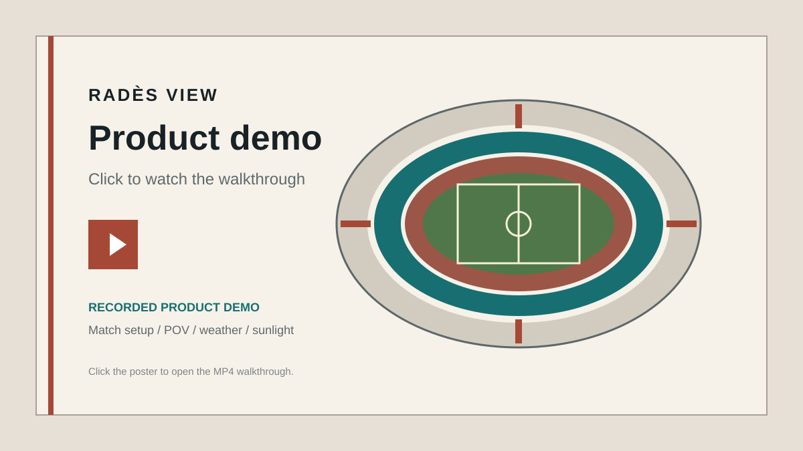

# Radès View

Radès View is an interactive procedural 3D representation of Stade Olympique Hammadi-Agrebi in Radès, Tunisia. The long-term product will let spectators explore the stadium, preview an approximate first-person seat view, and understand geometric sun exposure during a match.

**Live website:** [rades-seat-viewer.vercel.app](https://rades-seat-viewer.vercel.app)

**Creator:** [Play HickoDev games](https://hickodev.itch.io/) · [GitHub](https://github.com/HickoDev) · [Instagram](https://www.instagram.com/alidridi_9/?hl=en)

## Product preview

[](https://rades-seat-viewer.vercel.app)

The poster opens the live product today. The reserved repository upload target for the final walkthrough is `docs/assets/rades-view-demo.mp4`; see the [production notes](docs/production-notes.md#demo-video-preview) before adding a large media file.

This repository contains **Milestones 1–17**: the interactive procedural stadium, source-informed Radès calibration, detailed section barriers and concourses, rounded instanced seats, organic low-poly spectators and a 22-player match scene, populated photo-calibrated technical areas, a covered 30-metre player route with a main-stand opening, guided seat and virage-terrace POV modes, four spiral ramp towers, open exterior cross-bracing, Radès-specific honor/press and ceremonial-entrance architecture, detailed tensile-roof seams, suspended scoreboards, goal nets and synchronized creator-campaign hoardings, structural occluders, astronomical sun direction, selected-view shadow raycasts, five-minute exposure timelines, glare classification, validated short-range weather forecasts, cached section/row sunlight heatmaps, an accessible 2D exposure plan, and a production hardening pass. It is not a ticket-booking application.

## Requirements

- Node.js 24 LTS
- npm
- A browser with WebGL support

## Setup

```bash
npm install
npm run dev
```

Open `http://127.0.0.1:5173`.

## Quality checks

```bash
npm run format:check
npm run typecheck
npm run lint
npm run test
npm run build
npm run test:e2e
```

Install the Playwright Chromium binary first if the environment does not already have it:

```bash
npx playwright install chromium
```

## Foundation architecture

- `src/app` composes application-level providers and the responsive shell.
- `src/scene` owns React Three Fiber canvas concerns, lighting, environment, camera controls, and pixel-ratio adaptation.
- `src/stadium` is the stable composition boundary for future procedural geometry.
- `src/people` generates improved shared human geometry, deterministic crowd placement, technical-area occupants, and the animated 22-player match scene.
- `src/stadium/config/radesStadiumConfig.ts` is the single typed source of stadium measurements.
- `src/state` contains serializable interaction state only; Three.js objects stay in the scene layer.
- `src/ui` contains accessible DOM controls outside the WebGL canvas.
- `src/sunlight` separates astronomical direction, geometric occlusion, glare, timeline, cache, and heatmap classification concerns.
- `src/weather` contains the dedicated Open-Meteo client, Zod contract, Query hook, and radiation-based assessment helpers.
- `src/workers` runs representative heatmap raycasts away from the animation and interface thread.
- `src/test` and `e2e` contain Vitest/Testing Library setup and Playwright smoke coverage.

TanStack Query caches Open-Meteo requests, while Zod validates every response before it reaches the interface. Forecasts are only requested inside Open-Meteo's 16-day horizon; astronomical simulation remains available for long-range dates. GSAP handles reduced-motion-aware camera flights, SunCalc and Luxon handle astronomy and `Africa/Tunis` time, and `three-mesh-bvh` accelerates repeated rays against static complex occluders.

Heatmaps use one representative seat per section or per row, run in a Web Worker only when event time, resolution, or the central configuration version changes, and cache results in local storage. They are deliberately labelled as representative estimates and appear in a dedicated clickable 2D plan; permanent chair and spectator-clothing colors never change with exposure. Auto rendering quality caps device pixel ratio and selects simpler shared seat and spectator geometry plus a lower crowd occupancy on compact touch devices. People use independent lathed anatomical profiles, capsule limbs, hands, necks, and separate hair geometry instead of box-and-sphere silhouettes. A restrained seated-crowd sample receives subtle idle motion, virage supporters use staggered bounce motion, and the 22 players follow a coordinated dribble/pass route around a moving ball. Reduced-motion preferences freeze those systems, and all people remain excluded from sunlight-occluder raycasts.

The initial match form is deliberately separated from the deferred 3D experience, so Three.js, the generated stadium, and crowd metadata load only after the user continues to seat selection. See [production notes](docs/production-notes.md) for deployment, caching, bundle boundaries, heatmap semantics, accessibility, demo-media instructions, and the release checklist.

## Measurement and calibration status

The model separates sourced facts from procedural estimates in the central typed configuration:

- The 105 × 68 metre pitch and `Africa/Tunis` timezone remain explicit project requirements.
- Stadium contractor SBF historically reports 60,000 places, a 13,000 m² covered enclosure, and 64 portal frames reaching 33 m. This is not presented as the current usable capacity or as a count of plastic chair instances.
- Published facility summaries report a 7,000-place honor tribune and a press tribune with 300 desks. Those capacities are recorded separately from the photo-calibrated suite geometry.
- The lower virages are modeled as stepped terraces without individual chair instances, following project-owner calibration. Upper-virage chairs remain visible but those sections are closed to visitor POV selection. Exact angular boundaries still require seating plans.
- Public labels no longer call an entire ring “Enceinte.” The main-stand side is divided into Enceinte inférieure and Enceinte supérieure around the official Tribune block; the opposite long stand is Pelouse. Geometric tiers are neutrally named Niveau inférieur and Niveau supérieur.
- The stadium centre and baseline pitch bearing come from OpenStreetMap geometry, not a land survey. The rendered geographic orientation applies the project-owner requested 180-degree reversal consistently to sunlight, exposure raycasts, heatmaps, and true north.
- The supplied exact-model reference is represented with an eight-lane oval and a straight-side jump facility. Track construction details, all bowl radii, roof radii, access ramps, and other uncertain dimensions remain configurable estimates pending survey data.
- Radès photo and authorized-render references show light-concrete radial aisles, edge barriers, recessed tier vomitories, arched concourse bays between tiers, warm field-event aprons inside the track bends, and a continuous trackside safety rail. Vomitories clear both chairs and tier concrete and continue toward the rear concourse. The four lower virage separations are open, barrier-lined structural cuts rather than stairs or access ramps.
- The beige scalloped membrane, gray underside, deep cross-braced white inner truss, cable-stayed masts, end scoreboards, glazed honor frontage, and cream/blue/yellow main entrance are modeled as configurable visual estimates. See the [visual calibration record](docs/rades-visual-calibration.md).
- Interior photographs locate two long segmented translucent-blue dugouts on the athletics track in front of the main stand. Their modeled dimensions, offsets, seating, and occupants are photo-calibrated estimates rather than surveyed measurements.
- A January 2023 report documents an approximately 30-metre retractable covered players' tunnel reaching the playing area. The procedural route now passes through a dedicated lower-stand opening between widened technical areas, with matching gaps in the trackside rail, early seating rows, and advertising line. Its exact width and frame spacing remain estimates.
- Exterior and aerial photographs show four circular ramp towers, an open dark gallery with repeated white X-bracing, scalloped membrane bays, and a formal landscaped entrance axis. These elements are now represented procedurally, with their unsurveyed dimensions kept in central configuration.

Section barriers stay on the edges of radial aisles rather than across them. This preserves the clear circulation channel: FIFA identifies radial gangways, lateral routes, and vomitories as part of stadium circulation and notes that route widths must be established by applicable safety methodology. Barrier sizes and portal spacing in this model remain calibration estimates rather than code-compliance claims.

Calibration references:

- [SBF supporting structure project](https://sbf.com.tn/en/the-supporting-structure-of-the-olympic-stadium/)
- [FIFA pitch dimensions and surrounding areas](https://publications.fifa.com/de/football-stadiums-guidelines/technical-guideline/stadium-guidelines/pitch-dimensions-and-surrounding-areas/)
- [IFAB Law 3 — two teams of up to eleven players](https://www.theifab.com/laws/latest/the-players/)
- [OpenStreetMap stadium geometry](https://www.openstreetmap.org/way/104576770)
- [OpenStreetMap mapped pitch geometry](https://www.openstreetmap.org/way/26235346)
- [French-language stadium summary](https://fr.wikipedia.org/wiki/Stade_olympique_de_Rad%C3%A8s)
- [Wikimedia Commons Radès stadium photo archive](https://commons.wikimedia.org/wiki/Category:Rad%C3%A8s_stadium)
- [2017 interior photograph showing aisles, vomitories, and the concourse](https://commons.wikimedia.org/wiki/File:Stade_de_Rad%C3%A9s_2017_1.jpg)
- [Mosaïque FM interior photograph showing the Radès technical-area shelters](https://www.mosaiquefm.net/fr/football/1138703/est-zamalek-les-virages-du-stade-de-rades-ouverts)
- [Webdo report and photograph of the extended player tunnel](https://www.webdo.tn/fr/actualite/sport/stade-hamadi-agrebi-de-rades-le-tunnel-menant-aux-vestiaires-rallonge/202187/)
- [Radès ticket categories listing Pelouse, Enceinte supérieure, Enceinte inférieure, and Tribune](https://www.tuniscope.com/article/397947/actualites/sport/ca-cab-detail-de-la-vente-des-billets-121714)
- [FIFA stadium-bowl circulation guidance](https://publications.fifa.com/de/football-stadiums-guidelines/general-process-guidelines/design/stadium-bowl/)
- [SGSA Guide to Safety at Sports Grounds overview](https://sgsa.org.uk/document/greenguide/)

The result should be described as a recognisable procedural approximation, not an exact digital twin.

## Reference and implementation independence

The public `thebuggeddev/football-stadium` repository was designated as a conceptual reference. Its current public Git history contains a Vite starter rather than the described stadium implementation. Radès View therefore uses an independently written modular architecture and does not copy source, branding, interface, commerce flows, or decorative assets from that project.
